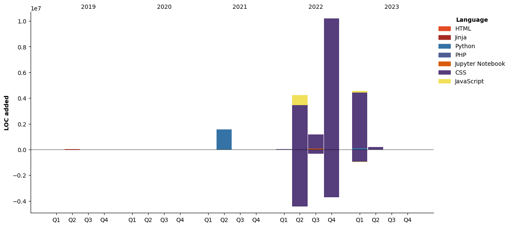

- 👋 Hi, I’m @devgourram
- 👀 I’m interested in IT architecture & design
- 🌱 I’m currently tech lead Php

<!---
devgourram/devgourram is a ✨ special ✨ repository because its `README.md` (this file) appears on your GitHub profile.
You can click the Preview link to take a look at your changes.
--->


<!--START_SECTION:waka-->
<!--END_SECTION:waka-->

# My Contribution to HiitConsulting Organization


**🐱 My GitHub Data**

> 📦 271 Bytes Used in GitHub's Storage
>
> 🏆 775 Contributions in the Year 2023
>
> 🚫 Not Opted to Hire
>
> 📜 3 Public Repositories
>
> 🔑 1 Private Repositories
>
**I'm an Early 🐤**

```text
🌞 Morning                18589 commits       ████████░░░░░░░░░░░░░░░░░   30.76 % 
🌆 Daytime                36366 commits       ███████████████░░░░░░░░░░   60.18 % 
🌃 Evening                5472 commits        ██░░░░░░░░░░░░░░░░░░░░░░░   09.06 % 
🌙 Night                  2 commits           ░░░░░░░░░░░░░░░░░░░░░░░░░   00.00 % 
```
📅 **I'm Most Productive on Wednesday**

```text
Monday                   10955 commits       █████░░░░░░░░░░░░░░░░░░░░   18.13 % 
Tuesday                  11845 commits       █████░░░░░░░░░░░░░░░░░░░░   19.60 % 
Wednesday                16050 commits       ███████░░░░░░░░░░░░░░░░░░   26.56 % 
Thursday                 11797 commits       █████░░░░░░░░░░░░░░░░░░░░   19.52 % 
Friday                   9321 commits        ████░░░░░░░░░░░░░░░░░░░░░   15.42 % 
Saturday                 23 commits          ░░░░░░░░░░░░░░░░░░░░░░░░░   00.04 % 
Sunday                   438 commits         ░░░░░░░░░░░░░░░░░░░░░░░░░   00.72 % 
```


📊 **This Week I Spent My Time On**

```text
🕑︎ Time Zone: Africa/Casablanca

💬 Programming Languages: 
YAML                     26 mins             █████████████████████░░░░   82.93 % 
Markdown                 5 mins              ████░░░░░░░░░░░░░░░░░░░░░   16.54 % 
GitIgnore file           0 secs              ░░░░░░░░░░░░░░░░░░░░░░░░░   00.53 % 

🔥 Editors: 
PhpStorm                 32 mins             █████████████████████████   100.00 % 

🐱‍💻 Projects: 
my-github-activities     32 mins             █████████████████████████   100.00 % 

💻 Operating System: 
Mac                      32 mins             █████████████████████████   100.00 % 
```

**I Mostly Code in PHP**

```text
PHP                      5 repos             ████████░░░░░░░░░░░░░░░░░   31.25 % 
JavaScript               3 repos             █████░░░░░░░░░░░░░░░░░░░░   18.75 % 
Python                   3 repos             █████░░░░░░░░░░░░░░░░░░░░   18.75 % 
HTML                     1 repo              ██░░░░░░░░░░░░░░░░░░░░░░░   06.25 % 
Dart                     1 repo              ██░░░░░░░░░░░░░░░░░░░░░░░   06.25 % 
```


**Timeline**




Last Updated on 12/04/2023 05:47:12 UTC

